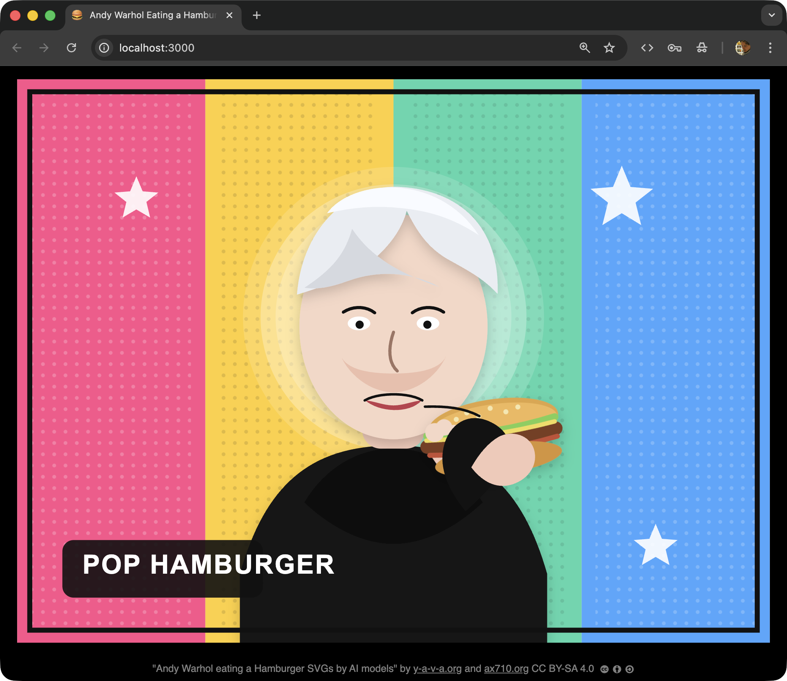

# Andy Warhol eating a Hamburger

A slideshow of SVGs generated by various AI models, each given the same prompt: draw Andy Warhol eating a hamburger.

Inspired by Simon Willison's [pelican on a bicycle](https://simonwillison.net/2024/Oct/25/pelicans-on-a-bicycle/) benchmark, which tests AI model SVG generation quality by asking each model to draw the same subject — a subject unlikely to exist verbatim in training data.

"Andy Warhol eating a Hamburger SVGs by AI models" by [y-a-v-a.org](https://y-a-v-a.org) and [ax710.org](https://ax710.org) is licensed under [CC BY-SA 4.0](https://creativecommons.org/licenses/by-sa/4.0/).
