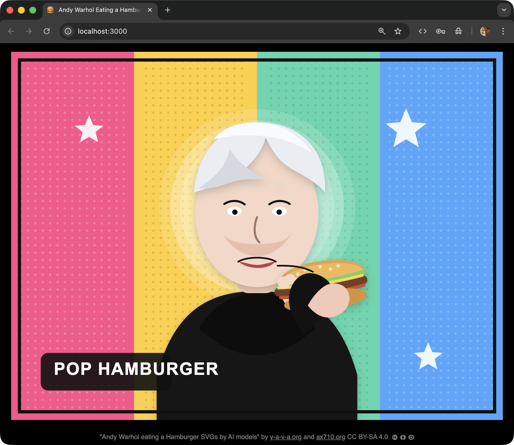

# Andy Warhol eating a Hamburger



**Prompt**

```
Can you write an svg file depicting Andy Warhol eating a hamburger?
```

A slideshow of SVGs generated by various AI models, each given the same prompt: draw Andy Warhol eating a hamburger.

Inspired by Simon Willison's [pelican on a bicycle](https://simonwillison.net/2024/Oct/25/pelicans-on-a-bicycle/) benchmark, which tests AI model SVG generation quality by asking each model to draw the same subject — a subject unlikely to exist verbatim in training data.

## Generating SVGs

`generate-svgs.js` sends the prompt to every text-to-text model on [OpenRouter](https://openrouter.ai) and saves the first `<svg>…</svg>` block from each response to `assets/<slug>.svg`. It skips a model if it already has an SVG, is listed in `skip.json`, or has a `:batch` suffix.

```sh
node generate-svgs.js [options]
```

### Options

| Option            | Description                                                                         |
| ----------------- | ----------------------------------------------------------------------------------- |
| `--add-skip <id>` | Add a model id to `skip.json` and exit. Can be repeated. `--add-skip=<id>` also works. |
| `-h`, `--help`    | Show help and exit.                                                                 |

### Environment variables

| Variable             | Default        | Description                                                                                  |
| -------------------- | -------------- | -------------------------------------------------------------------------------------------- |
| `OPENROUTER_API_KEY` | —              | Required, also for dry runs. Not needed for `--add-skip` or `--help`.                        |
| `LIMIT`              | `5`            | Maximum number of models to query in one run.                                                |
| `PROMPT`             | the prompt above | Replaces the base prompt.                                                                  |
| `FORCE`              | —              | Set to `1` to regenerate even when an SVG already exists.                                    |
| `ONLY`               | —              | Comma-separated substrings. Only models whose id contains at least one of them are queried.  |
| `SKIP`               | —              | Comma-separated model ids to skip for this run only.                                         |
| `DRY`                | —              | Set to `1` to list which models would be queried, without calling them.                      |
| `TIMEOUT`            | `180`          | Request timeout in seconds.                                                                  |
| `SLEEP`              | `2`            | Pause between requests in seconds.                                                           |

### Examples

```sh
LIMIT=10 node generate-svgs.js
ONLY=claude DRY=1 node generate-svgs.js
node generate-svgs.js --add-skip some-vendor/some-model
```

"Andy Warhol eating a Hamburger SVGs by AI models" by [y-a-v-a.org](https://y-a-v-a.org) and [ax710.org](https://ax710.org), 2026, is licensed under [CC BY-SA 4.0](https://creativecommons.org/licenses/by-sa/4.0/).